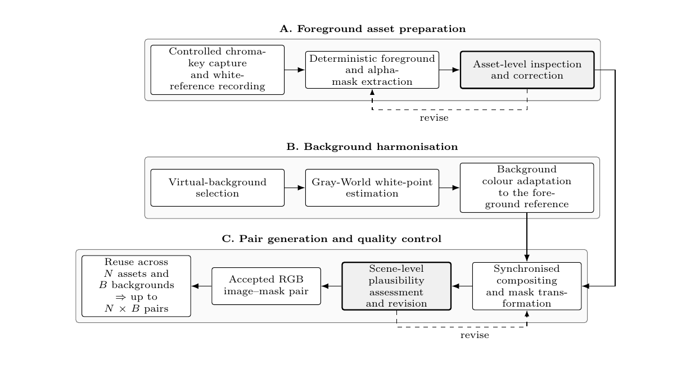
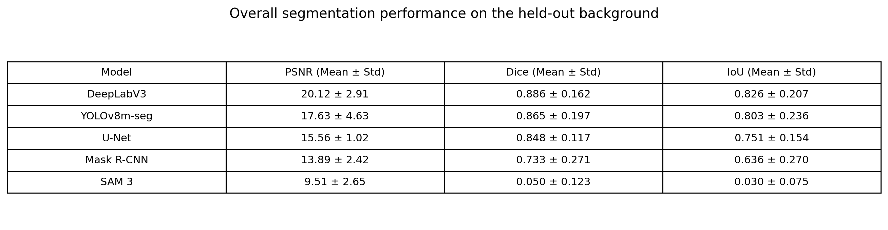
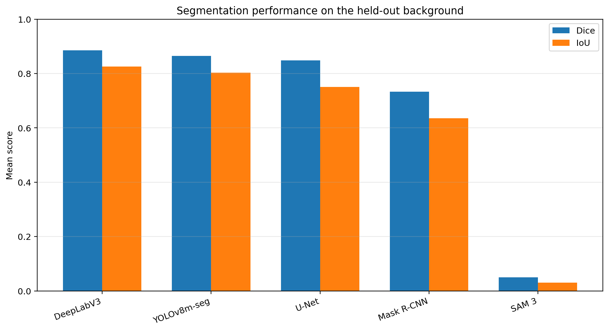
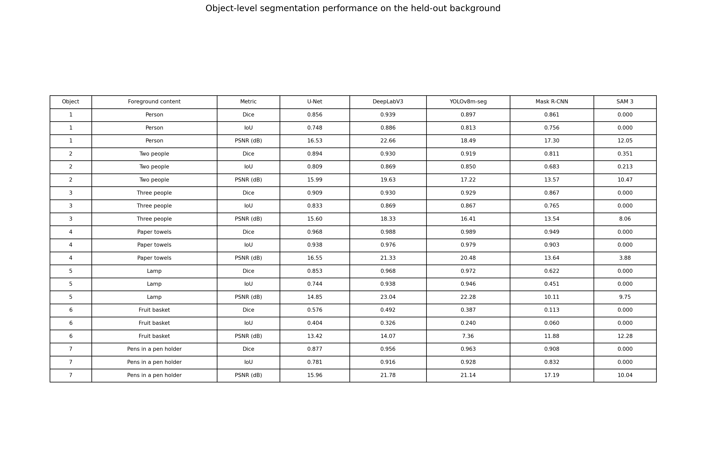

# virtual-production-key-mask-dataset
Dataset generation methodology, code, trained models, and experimental results for key-mask segmentation in virtual production.

# Scalable and Quality-Controlled Key-Mask Dataset Generation for Virtual Production

This repository accompanies the paper:

**Scalable and Quality-Controlled Key-Mask Dataset Generation for Virtual Production**

The repository contains the dataset-generation code, model-training and
evaluation code, experimental configurations, quantitative results, qualitative
comparisons, and links to the complete dataset and trained model checkpoints.

## Dataset Generation Methodology

The proposed methodology integrates foreground asset preparation, background
harmonisation, and synchronised image–mask generation within a unified
quality-controlled workflow.

First, foreground objects are captured under controlled chroma-key conditions
together with a white reference. Deterministic extraction produces a reusable
RGB foreground asset and its corresponding 8-bit alpha mask. Each extracted
asset is inspected and corrected before reuse.

Second, the selected virtual background is harmonised with the foreground
capture conditions using Gray-World white-point estimation and colour
adaptation.

Finally, the approved foreground asset and adapted background are composited
using synchronised transformations of the RGB image and its mask. Each
composite is assessed for foreground scale, placement, colour consistency,
contextual appropriateness, and overall scene plausibility. Samples that do not
meet these criteria are revised before inclusion in the dataset.

## Dataset

The proof-of-concept dataset contains 63 image–mask pairs generated from:

- 7 foreground assets
- 9 virtual backgrounds

The background-disjoint split contains:

- 49 training images using Backgrounds 1–7
- 7 validation images using Background 8
- 7 test images using Background 9

## Mask representation

The dataset-generation workflow produces 8-bit alpha masks with opacity values
from 0 to 255, including intermediate values along object boundaries.

For the segmentation experiments, the alpha masks were binarised by assigning
pixels with non-zero opacity to the foreground class and fully transparent
pixels to the background class.

## Evaluated models

- U-Net with a ResNet-34 encoder
- DeepLabV3 with a ResNet-34 backbone
- YOLOv8m-seg
- Detectron2 Mask R-CNN with R50-FPN
- Segment Anything with Concepts (SAM 3)

## Complete dataset and results

The complete dataset, trained checkpoints, predictions, metrics, training
histories, and comparison figures are available under the GitHub Release
`v1.0.0`.

## Reproducibility

All images were resized to 512 × 512 pixels. Training, validation, and test
subsets were separated by background. Configuration files and training logs
are provided for each evaluated model.

## Results

The following results were obtained on the background-disjoint test set containing
seven images from the held-out Background 9.

### Overall performance

DeepLabV3 achieved the highest mean performance across PSNR, Dice, and IoU,
followed by YOLOv8m-seg. U-Net remained competitive, while Mask R-CNN showed
lower and less consistent performance. SAM 3 returned no mask for six of the
seven test images and therefore achieved the lowest mean scores.

### Object-level performance

Object 4 (paper towels) and Object 7 (pens in a pen holder) produced the strongest
results across the trained models. Object 6 (fruit basket) was the most challenging,
indicating that object shape, texture, boundary definition, and contrast with the
background influenced segmentation performance.

These results should be interpreted as a controlled proof of concept. The dataset
contains seven foreground assets and one held-out test background, so broader
generalisation requires additional objects and more varied capture conditions.

## Citation

Please cite the accompanying paper and repository when using these materials.
